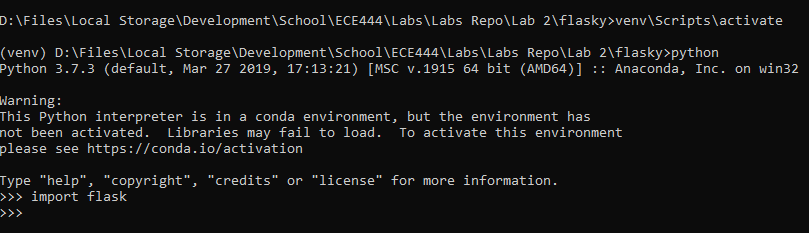
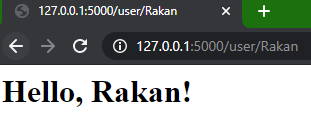

# ECE444-F2020-Lab2

This repo is a clone of https://github.com/miguelgrinberg/flasky

## Activity 1

## Activity 2

## Activity 3
Flask context globals allow for a thread to have access to important variables as if they were global variables, without the need to share among threads. These can be split into application contexts and request contexts.
